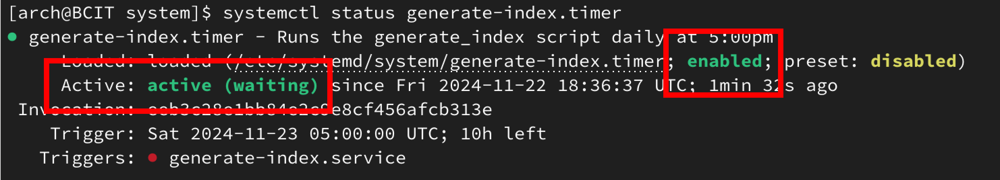
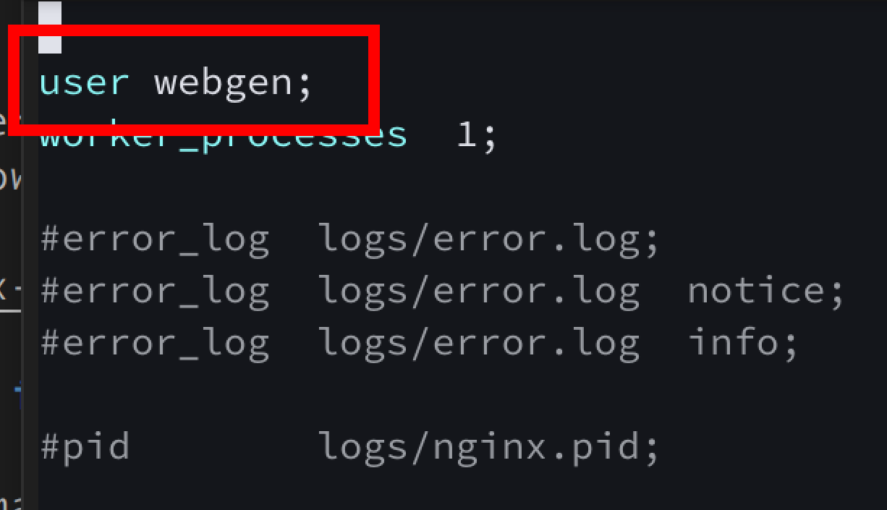

# Assignment-3-Part-1-NGINX

## Introduction

This assignment focuses on building and configuring a simple automated system to generate and serve system information as a static HTML page. The task involves scripting, system administration, and secure server management. Specifically, we will:

- Create a system user for secure script execution.
- Automate script execution daily using `systemd` services and timers.
- Configure Nginx to serve the HTML file on an Arch Linux server.
- Secure the server using a firewall configured with `ufw`.

The assignment includes using skills such as Bash scripting, `systemd` management, web server configuration, and basic firewall security.

> **Note:** Ensure you have root or sudo privileges to perform the tasks outlined in this assignment.

## Table of contents

## Task 1: Setting up System User with Ownership and Directories 

The first step is creating the system user `webgen` with a home directory of `/var/lib/webgen`, giving it ownership, and an appropriate login shell for a non-login user.

  ```bash
  sudo useradd -r -d /var/lib/webgen -s /usr/sbin/nologin webgen
  ```

### Explanation of `useradd` Options

- **`-r` system account:**  
  Creates a system user with a UID below 1000. System users are typically used for non-login tasks like running services.

- **`-d` home directory:**  
  Specifies the user’s home directory path, in our case its `/var/lib/webgen`.

- **`-s` shell:**  
  Sets the login shell. Using `/usr/sbin/nologin` disables interactive logins for `webgen`, which is ideal for system users.

> **Important:** Using these specific options ensures that the `webgen` user is configured securely for non-login tasks.

### Creating Subdirectories `/bin` and `/HTML`

We need to create the following subdirectories within the `webgen` directory. To do so, type the following:

```bash
sudo mkdir -p /var/lib/webgen/bin
sudo mkdir -p /var/lib/webgen/HTML
```

### Cloning the `generate_index` Script into `/bin/`

To set up the `generate_index` script, you can clone it from the sourcehut repo and place it in the `/bin/` directory. 

1. First, change into the `/bin/` directory:
  ```bash
  cd /var/lib/webgen/bin
  ```

2. Second, clone the repo with the following:
  ```bash 
  git clone https://git.sr.ht/~nathan_climbs/2420-as2-start generate_index
  ```

3. Third, make sure the script is executable:
  ```bash 
  sudo chmod +x /var/lib/webgen/bin/generate_index
  ```

### Setting Ownership for the `webgen` System User

By running the following command, the `webgen` user will have ownership of its home directory and all subdirectories and files:
```bash
sudo chown -R webgen:webgen /var/lib/webgen
```

### Explanation of Setting Ownership Options

- **`-R` recursive:**  
  This command changes the ownership of `/var/lib/webgen` and all files and subdirectories within it, ensuring that all files in the directory are owned by the `webgen` user and group.

> **Caution:** Ensure you use the `-R` option to avoid permission issues with subdirectories and files.

## Task 2: Creating and Configuring `systemd` Service and Timer

### Creating the Service File

The first step is creating the service file `generate-index.service` that will run the `generate_index` script.

```bash 
sudo nvim /etc/systemd/system/generate-index.service
```

Once you're in the editor, add the following:

```ini
[Unit]
Description=Generate Index Service File

[Service]
Type=simple
User=webgen
Group=webgen
ExecStart=/var/lib/webgen/bin/generate_index
```

### Creating the Timer Script

Next, we will create a timer that runs the script daily at 5:00 PM. To do so, write the following command:

```bash
sudo nano /etc/systemd/system/generate-index.timer
```

Once you're in the editor, add the following:

```ini
[Unit]
Description=Runs the generate_index script daily at 5:00 PM 

[Timer]
OnCalendar=*-*-* 17:00:00
Unit=generate-index.service
Persistent=true

[Install]
WantedBy=timers.target
```

### Explanation of the Service File

#### [Unit]
- **Description:** A brief description of the service.

#### [Service]
- **Type=simple:** This tells systemd that the service is a simple service that does not fork. It starts immediately and runs in the foreground.
- **ExecStart=/var/lib/webgen/bin/generate_index:** Specifies the command that will be executed when the service starts. Here, it runs the `generate_index` script located in `/var/lib/webgen/bin/generate_index`.

> **Note:** The `Type=simple` option means that the service is considered started immediately when the `ExecStart` command is executed.

### Starting and Enabling the Timer and Service

After creating the service file and the timer file, we need to start and enable the timer so it runs every time you boot up your computer.

```bash
sudo systemctl start generate-index.timer
sudo systemctl enable generate-index.timer
```

To check and see if the timer is active and the service is running, you can run the following commands:

```bash
systemctl status generate-index.timer
systemctl status generate-index.service
```



You can also use the `journalctl` command to see the logs of `generate-index.service`.

```bash
journalctl -u generate-index.service
```

This would be the output showing that it will successfully run daily at 5:00 PM.


> **Note:** Remember to add the missing pictures.

## Task 3: Configuring Nginx

To start, we need to modify the main `nginx.conf` file to ensure the server runs as the `webgen` user. Before we do that, we have to download Nginx.

```bash
sudo pacman -Syu nginx
```

After downloading Nginx, we can then start to edit the main file with the following command:

```bash
sudo nvim /etc/nginx/nginx.conf
```

You want to change the user from the default to `webgen`, and it should look like the following image:



### Adding a Server Block

A server block in Nginx defines how requests are processed for a specific domain or IP address. It allows hosting multiple websites on a single server with different configurations. We wil create a new fconf

```bash
sudo nvim /etc/nginx/nginx.conf
```

Add the following server block configuration:

```nginx
server {
   listen 80;
   server_name local-webgen;

   root /var/lib/webgen/HTML;
   index index.html;

   location / {
      try_files $uri $uri/ =404;
   }
}
```

### Explanation of the Server Block

- **`listen 80;`**  
  Configures Nginx to listen on port 80 for HTTP traffic.

- **`server_name local-webgen;`**  
  Defines the server name for the block.

- **`root /var/lib/webgen/HTML;`**  
  Sets the root directory for the website files.

- **`index index.html;`**  
  Specifies the default file to serve (e.g., `index.html`) when a directory is requested.

- **`location / { try_files $uri $uri/ =404; }`**  
  Ensures Nginx tries to serve the requested file or directory. If it doesn't exist, a `404 Not Found` error is returned.

> **Important:** Using a separate server block file instead of modifying the main `nginx.conf` file directly helps maintain an organized configuration. It allows you to make updates and changes to an individual server without affecting the main `nginx.conf`, and if there are any issues, you can isolate the problem more easily.g

### Checking Nginx Service Status

To make sure that Nginx is running properly and the config file we made works, we can use the following commands:

1. **Check the status of the Nginx service:**

  ```bash
  sudo systemctl status nginx
  ```

2. **Test the Nginx configuration for syntax errors:**

  ```bash
  sudo nginx -t
  ```

  This command will check the Nginx config files for any syntax errors.

3. **Restart Nginx to apply any changes:**

  ```bash
  sudo systemctl restart nginx
  ```

  ## Task 4: Installing and Configuring `ufw` with ssh and http
To start we will first install `ufw`, we can do so by typing in the following command.
```bash
sudo pacman -Syu ufw
```
> **Caution:** Do not enable `ufw` immediately after installation, as it may lock you out of your SSH session. Ensure you have allowed SSH connections before enabling the firewall.

```bash
sudo ufw allow ssh
```
## References

- [Arch Linux Wiki: Users and Groups](https://wiki.archlinux.org/title/Users_and_groups)
- [Arch Linux Wiki: Nginx Server Blocks](https://wiki.archlinux.org/title/Nginx#Server_blocks)
- [Arch Linux Wiki: Nginx](https://wiki.archlinux.org/title/Nginx)
- [Arch Linux Wiki: Running Nginx as a Specific User](https://wiki.archlinux.org/title/Nginx#Running_as_a_specific_user)

